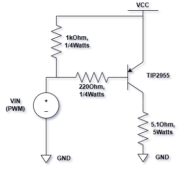

# Temperature-Controller-with-PID-Controller
A PWM-based and a reverse mode PID temperature controller with Arduino Uno, TIP2955 with resistors as the PWM inverter, and LM35 sensor, implemented Ziegler-Nichols tuning method (Open-Loop and Closed-Loop).

The circuit diagram can be seen below.

LM35 sensor connected to 5,5Ohm 5Watts resistor and it reads the temperature of the resistor in real-time.
The measured temperature processed by the PID controller to generate correct PWM duty cycle so that the next measured temperature will be as close as the temperature setpoint.